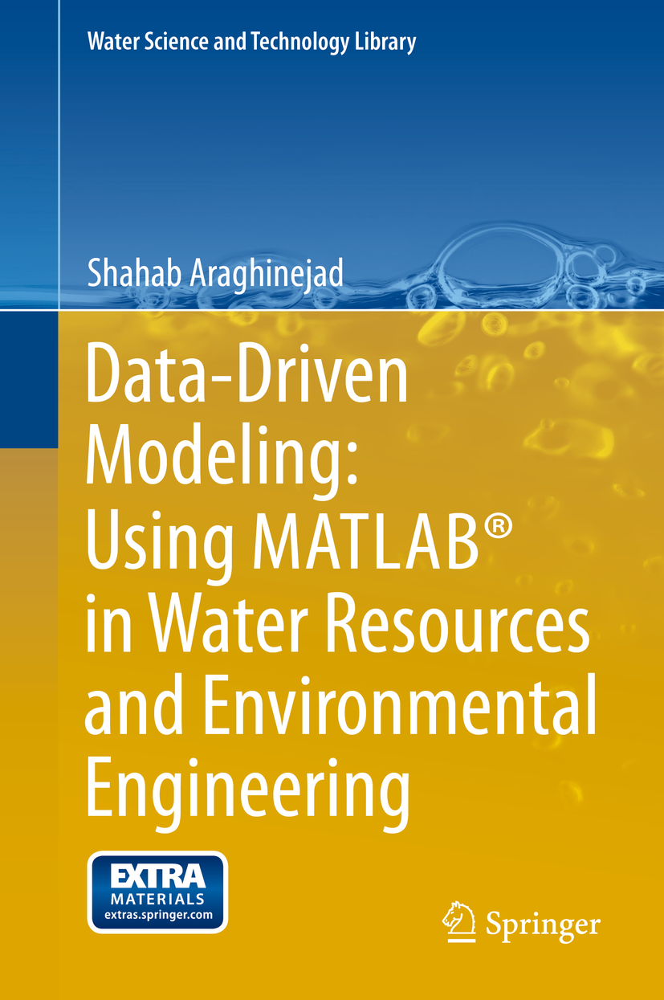

# Data-Driven Modeling Using MATLAB in Water Resources and Environmental

  

* Publisher http://www.springer.com/gp/book/9789400775053?wt_mc=ThirdParty.SpringerLink.3.EPR653.About_eBook  

## Toc
* [1 Introduction]()  
* [2 Basic Statistics]()  
* [3 Regression-Based Models]()  
* [4 Time Series Modeling]()  
* [5 Artificial Neural Networks]()  
* [6 Support Vector Machines]()  
* [7 Fuzzy Models]()  
* [8 Hybrid Models and Multi-model Data Fusion]()  