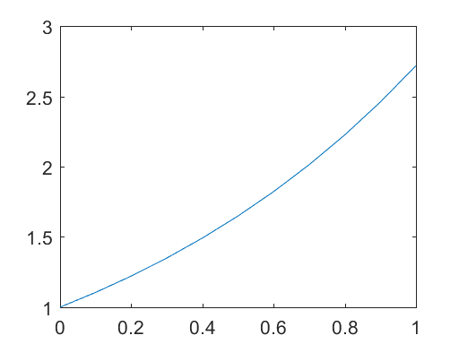
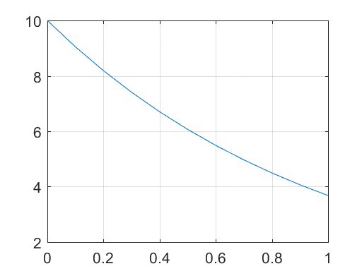

# 1 Introduction


```python
%load_ext pymatbridge
```

    C:\Anaconda3\lib\site-packages\IPython\nbformat.py:13: ShimWarning: The `IPython.nbformat` package has been deprecated. You should import from nbformat instead.
      "You should import from nbformat instead.", ShimWarning)
    

    Starting MATLAB on ZMQ socket tcp://127.0.0.1:42258
    Send 'exit' command to kill the server
    ........................MATLAB started and connected!
    

# 1.1 Environmental Modeling Using MATLAB

# 1.2 Introduction to MATLAB

## 1.2.1 Getting Started with MATLAB

## 1.2.2 Matrices in MATLAB

## 1.2.3 Basic Matrix Operations

# 1.3 A Simple Environmental Model


```python
%%matlab
alpha = 1;
c0 = 1;
t = [0:0.1:1];
f = c0*exp(alpha*t);
plot(t,f)
```





```python
%%matlab
lambda = 1; 
c0 = 10;
t = [0:0.1:1];
f = c0*exp(-lambda*t);
plot(t,f)
grid;
```





# 1.4 MATLABR Graphics – The Figure Editor

# 1.5 MATLABR Help Syste
