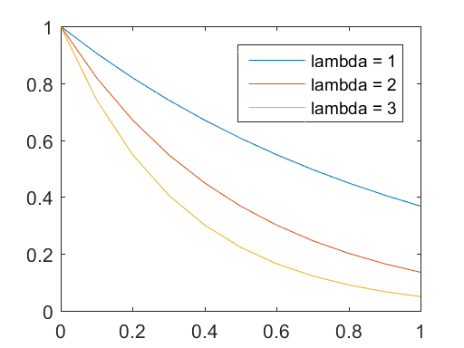

```python
%load_ext pymatbridge
```

    C:\Anaconda3\lib\site-packages\IPython\nbformat.py:13: ShimWarning: The `IPython.nbformat` package has been deprecated. You should import from nbformat instead.
      "You should import from nbformat instead.", ShimWarning)
    

    Starting MATLAB on ZMQ socket tcp://127.0.0.1:41980
    Send 'exit' command to kill the server
    ...............MATLAB started and connected!
    

# 2 Funda mentals of Modeling

# 2.1 Model Types

# 2.2 Modeling Steps

# 2.3 Fundamental Laws

## 2.3.1 Conservation of Mass

## 2.3.2 Conservation of Momentum

## 2.3.3 Conservation of Energy

# 2.4 Continuity Equation for Mass

# 2.5 MATLAB M-file


```python
%%matlab
lambda = 1
c0 = 1;
t = [0:0.1:1];
f = c0 * exp(-lambda*t);
plot(t, f);
hold on;

lambda = 2
c0 = 1;
t = [0:0.1:1];
f = c0 * exp(-lambda*t);
plot(t, f);

lambda = 3
c0 = 1;
t = [0:0.1:1];
f = c0 * exp(-lambda*t);
plot(t, f);

legend('lambda = 1', 'lambda = 2', 'lambda = 3');
```


    
    lambda =
    
         1
    
    
    lambda =
    
         2
    
    
    lambda =
    
         3
    





# 2.6 Ifs and Loops in MATLAB

# 2.7 Debugging of M-files
