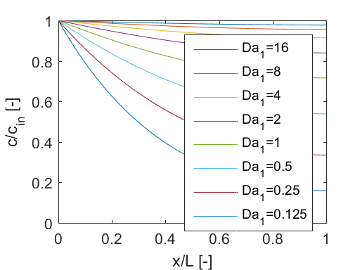

# 5 Tran sport with Decay and Degradation


```python
%load_ext pymatbridge
```

    C:\Anaconda3\lib\site-packages\IPython\nbformat.py:13: ShimWarning: The `IPython.nbformat` package has been deprecated. You should import from nbformat instead.
      "You should import from nbformat instead.", ShimWarning)
    

    Starting MATLAB on ZMQ socket tcp://127.0.0.1:19707
    Send 'exit' command to kill the server
    .....MATLAB started and connected!
    

## 5.1 Decay and Degradation


```python
%%matlab
plot([0:0.1:5], exp(-log(2)*[0:0.1:5])); 
grid;
xlabel('timet/t{1/2}');
ylabel('c/c0');
```


## 5.2 1D Steady State Solution


```python

```

## 5.3 Dimensionless Formulation


```python
# %load ch05/analtrans.m
function analtrans
% 1D transport - modelling with extensions for decay and linear sorption
%    using analytical solution of Ogata & Banks (1961)                   
%
%   $Ekkehard Holzbecher  $Date: 2006/02/08 $
%--------------------------------------------------------------------------                       
T = 1;                      % maximum time [s]
L = 1;                      % maximum length [m]
D = 0.1;                    % diffusivity / dispersivity [m*m/s]
v = 1;                      % velocity [m/s]
lambda = 0.0;               % decay coefficient [1/s]
R = 3;                      % retardation [1]
c0 = 0;                     % initial value [kg/m*m*m] (initial condition)
cin = 1;                    % inflow value [kg/m*m*m] (boundary condition)

M = 20;                     % number of timesteps
N = 20;                     % number of nodes  
%-------------------------- output parameters
gplot = 0;                  % =1: breakthrough curves; =2: profiles   
gsurf = 0;                  % surface
gcont = 0;                  % =1: contours; =2: filled contours
ganim = 2;                  % animation of profiles; =1: single line; =2: all lines

%-------------------------- execution--------------------------------------

e = ones (1,N);             % ones-vector
t = linspace (T/M,T,M);     % time discretization
x = linspace (0,L,N);       % space discretization
c = c0*e;                   % initial distribution
u = sqrt(v*v+4*lambda*R*D);

for i = 1:size(t,2)
    h = 1./(2.*sqrt(D*R*t(i)));       
    c = [c; c0*exp(-lambda*t(i))*(e-0.5*erfc(h*(R*x-e*v*t(i)))-...
        0.5*exp((v/D)*x).*erfc(h*(R*x+e*v*t(i))))+...
        (cin-c0)*0.5*(exp((v-u)/(D+D)*x).*erfc(h*(R*x-e*u*t(i)))+...
        exp((v+u)/(D+D)*x).*erfc(h*(R*x+e*u*t(i))))]; 
end

%-------------------- graphical output-------------------------------------
switch gplot
    case 1 
        plot ([0 t],c)        % breakthrough curves
        xlabel ('time'); ylabel ('concentration');
    case 2 
        plot (x,c','--')      % profiles
        xlabel ('space'); ylabel ('concentration');
end
if gsurf                      % surface
    figure; surf (x,[0 t],c); 
    xlabel ('space'); ylabel ('time'); zlabel('concentration');
end  
if gcont figure; end
switch gcont
    case 1 
        contour (x,[0 t],c)   % contours
        grid on; xlabel ('space'); ylabel ('time');
    case 2 
        contourf(x,[0 t],c)   % filled contours
        colorbar; xlabel ('space'); ylabel ('time');
end    
if (ganim)
    [FileName,PathName] = uiputfile('*.mpg');
    figure; if (ganim > 1) hold on; end 
    for j = 1:size(c,1)
        axis manual;  plot (x,c(j,:),'r','LineWidth',2); 
        YLim = [min(c0,cin) max(c0,cin)];
        legend (['t=' num2str(T*(j-1)/M)]);
        Anim(j) = getframe;
        plot (x,c(j,:),'b','LineWidth',2); 
    end
    mpgwrite (Anim,colormap,[PathName '/' FileName]);  % mgwrite not standard MATLAB
    figure; movie (Anim,0);   % play animation
end 
```


```python
%%matlab
%load ch05/analtrans_s1.m
% Steady state transport solutions for one Pe=0 and various values of Da2
x = [0:0.01:1];
Da2 = 8; mu1 = sqrt(Da2); mu2 = -mu1;
s = mu2*exp(mu2)-mu1*exp(mu1);
c = (mu2*exp(mu2)*exp(mu1*x)-mu1*exp(mu1)*exp(mu2*x))./s;
for Da2 = [4 2 1 0.5 0.25 0.125];
    s = sqrt(Da2); mu1 = s; mu2 = -s;
    s = mu2*exp(mu2)-mu1*exp(mu1);
    c = [c;(mu2*exp(mu2)*exp(mu1*x)-mu1*exp(mu1)*exp(mu2*x))./s];
end
plot (x,c);
legend('Da_2=8','Da_2=4','Da_2=2','Da_2=1','Da_2=0.5','Da_2=0.25','Da_2=0.125');

xlabel ('x/L [-]'); ylabel ('c/c_{in} [-]');
```


```python
%%matlab
%load ch05/analtrans_s2.m
% Steady state transport solutions for one fixed value of Da1 and various values of Pe 
x = [0:0.01:1];
Da1 = 1; 
c = exp(-Da1*x);
for Pe = [10 5 4 3 2 1 0.5 0.25];
    s = sqrt(0.25*Pe*Pe+Pe/Da1);
    mu1 = 0.5*Pe+s; mu2 = 0.5*Pe-s;
    s = mu2*exp(mu2)-mu1*exp(mu1);
    c = [c;(mu2*exp(mu2)*exp(mu1*x)-mu1*exp(mu1)*exp(mu2*x))./s];
end
plot (x,c);
legend('Pe=Inf','Pe=10','Pe=5','Pe=4','Pe=3','Pe=2','Pe=1','Pe=0.5','Pe=0.25');
xlabel ('x/L [-]'); ylabel ('c/c_{in} [-]');

```


```python
%%matlab
%load ch05/analtrans_s3.m
% Steady state transport solutions for one fixed value of Pe and various values of Da1
x = [0:0.01:1];
Pe = 1; Da1 = 16;
s = sqrt(0.25*Pe*Pe+Pe/Da1);
mu1 = 0.5*Pe+s; mu2 = 0.5*Pe-s;
s = mu2*exp(mu2)-mu1*exp(mu1);
c = (mu2*exp(mu2)*exp(mu1*x)-mu1*exp(mu1)*exp(mu2*x))./s;
for Da1 = [8 4 2 1 0.5 0.25 0.125];
    s = sqrt(0.25*Pe*Pe+Pe/Da1);
    mu1 = 0.5*Pe+s; mu2 = 0.5*Pe-s;
    s = mu2*exp(mu2)-mu1*exp(mu1);
    c = [c;(mu2*exp(mu2)*exp(mu1*x)-mu1*exp(mu1)*exp(mu2*x))./s];
end
plot (x,c);
legend('Da_1=16','Da_1=8','Da_1=4','Da_1=2','Da_1=1','Da_1=0.5','Da_1=0.25','Da_1=0.125');
xlabel ('x/L [-]'); ylabel ('c/c_{in} [-]');
```





```python
%%matlab
%load ch05/analtrans_s4.m
% Steady state transport solutions for one fixed value of Da2 and various values of Pe
x = [0:0.01:1];
Da2 = 1;
mu1 = sqrt(Da2); mu2 = -mu1;
s = mu2*exp(mu2)-mu1*exp(mu1);
c = (mu2*exp(mu2)*exp(mu1*x)-mu1*exp(mu1)*exp(mu2*x))./s;
for Pe = [0.0625 0.125 0.25 0.5 1 2 4 8 16];
    s = sqrt(0.25*Pe*Pe+Da2);
    mu1 = 0.5*Pe+s; mu2 = 0.5*Pe-s;
    s = mu2*exp(mu2)-mu1*exp(mu1);
    c = [c;(mu2*exp(mu2)*exp(mu1*x)-mu1*exp(mu1)*exp(mu2*x))./s];
end
plot (x,c);
legend('Pe=0','Pe=0.0625','Pe=0.125','Pe=0.25','Pe=0.5','Pe=1','Pe=2','Pe=4','Pe=8','Pe=16');
xlabel ('x/L [-]'); ylabel ('c/c_{in} [-]');

```


## 5.4 Transient Solutions


```python
# %load ch05/simpletrans.m
function simpletrans
% 1D transport - modelling with extensions for decay and linear sorption
%    using mixing cell method                   
%
%   $Ekkehard Holzbecher  $Date: 2006/02/08 $
%--------------------------------------------------------------------------
T = 2;                     % maximum time [s]
L = 1;                     % length [m]
D = 0.1;                   % dispersivity [m*m/s]
v = 1;                     % velocity [m/s]
lambda = 1.2;              % decay constant [1/s]
R = 1;                     % retardation [1]
c0 = 0;                    % initial concentration [kg/m*m*m]
cin = 1;                   % inflow concentration [kg/m*m*m]

dtout = 0.05;              % output-timestep [s]
dxmax = 0.02;              % maximum grid spacing [m]
%------------------------ output parameters
gplot = 2;                 % =1: breakthrough curves; =2: profiles   
gsurf = 0;                 % surface
gcont = 0;                 % =1: contours; =2: filled contours
ganim = 2;                 % animation

%------------------------ execution----------------------------------------

dtout = dtout/R;           % timestep reduction for retardation case 
dx = dtout*v;              % grid spacing
K = 1;                     % K = reduction factor for grid spacing
if (dx>dxmax) K = ceil(dx/dxmax); end
dx = dx/K;                 % reduced grid spacing
dtadv=dtout/K;             % advection-timestep 
N = ceil(L/dx);            % N = number of cells
x = linspace(0,(N-1)*dx,N);% nodes on x-axis  
Neumann = D*dtadv/dx/dx;   % Neumann-number for dispersion
M = max (1,ceil(3*Neumann)); % M = reduction factor to fulfill Neumann-condition 
Neumann = Neumann/M/R;     % reduced Neumann-number
dtdiff = dtadv/M;          % diffusion timestep
t = dtadv;

clear c c1 c2;
c(1:N) = c0; c1 = c;
k = 1; kanim = 1;
while (t < T/R)
    for i=1:M
        kinetics;          % decay (1. order kinetics) 
        diffusion;         % diffusion
    end
    advection;             % advection
    if k >= K  
        c = [c;c1]; k=0; 
    end
    t = t + dtadv; k = k+1;
end
xlabel ('space'); ylabel ('concentration');

%-------------------- graphical output-------------------------------------

switch gplot
    case 1 
        plot (c)        % breakthrough curves
        xlabel ('time'); ylabel ('concentration');
    case 2 
        plot (x,c','--')% profiles
        xlabel ('space'); ylabel ('concentration');
end
if gsurf                % surface
    figure; surf (x,[0 t],c); 
    xlabel ('space'); ylabel ('time'); zlabel('concentration');
end  
if gcont figure; end
switch gcont
    case 1 
        contour (c)     % contours
        grid on; xlabel ('space'); ylabel ('time');
    case 2 
        contourf(c)     % filled contours
        colorbar; xlabel ('space'); ylabel ('time');
end    
if (ganim)
    [FileName,PathName] = uiputfile('*.mpg'); 
    figure; if (ganim > 1) hold on; end 
    for j = 1:size(c,1)
        axis manual;  plot (x,c(j,:),'r','LineWidth',2); 
        ylim ([min(c0,cin) max(c0,cin)]); 
        legend (['t=' num2str(dtout*(j-1))]);  
        Anim(j) = getframe;
        plot (x,c(j,:),'b','LineWidth',2); 
    end
    mpgwrite (Anim,colormap,[PathName '/' FileName]);     % mgwrite not standard MATLAB 
    movie (Anim,0);   % play animation
end 
```


```python
# %load ch05/analtransnodim.m
function analtransnodim
% 1D transport - modelling with extensions for decay and linear sorption
%    for dimensionless parameters and variables
%    using extended version of analytical solution of Ogata & Banks (1961)                   
%
%   $Ekkehard Holzbecher  $Date: 2006/02/22 $
%--------------------------------------------------------------------------
M = 50;         % graph resolution
N = 10;         % number of curves
T = 1;          % maximum dimensionless time
Da = 1;         % (2nd) Damköhler number (lambda*R*L/v)
Pe = 100.;      % Peclet number (L/alphal)
R = 1;          % Retardation, only used for scale = 1;

c0 = 0.5;       % initial value
c1 = 1;         % inflow value

type = 1;       % =0: btcs; =1: profiles
scale = 1;      % =0: time scaling with respect to retarded advection; 
                % =1: time scaling for advection only
               
if ~scale R = 1; end    
y ='grbkcym';
e = diag(eye(M));
if scale u = sqrt(1+4*R*Da/Pe); else u = sqrt(1+4*Da/Pe); end
%figure;
set(gca,'FontSize',14);
if (type > 0) 
    %Solution as function of x 
    t = linspace (T/N,T,N);
    x = linspace (1/M,1,M);
    for i = 1:size(t,2)
        t0 = t(i);
        h = diag(1./(2.*sqrt(t0*R/Pe)));
        u1 = c0*exp(-Da*t0)*(e-0.5*erfc(h*(R*x'-e*t0))-0.5*exp(Pe*x').*erfc(h*(R*x'+e*t0)))+...
        c1*0.5*(exp(0.5*Pe*(1-u)*x').*erfc(h*(R*x'-e*u*t0))+exp(0.5*Pe*(1+u)*x').*erfc(h*(R*x'+e*u*t0)));
        hh = plot(x,u1,y(mod(i,7)+1)); 
        hold on;
    end
    xlabel('Distance {\it\xi} [-]'); 
else
    %Breakthrough curves     
    x = linspace (1/N,1,N);
    t = linspace (T/M,T,M);    
    h = diag(1./(2.*sqrt(t/Pe)));
    for i = 1:size(x,2)
        x0 = x(i);
        u1 = c0*exp(-Da*t').*(e-0.5*erfc(h*(e*x0-t'))-0.5*exp(Pe*x0)*erfc(h*(e*x0+t')))+...
        c1*0.5*(exp(0.5*Pe*(1-u)*x0)*erfc(h*(e*x0-u*t'))+exp(0.5*Pe*(1+u)*x0)*erfc(h*(e*x0+u*t')));
        hh = plot(t,u1,y(mod(i,7)+1));
        hold on; 
    end
    xlabel('Time {\it\tau} [-]');
end
ylabel('Concentration {\it\theta} [-]');
set (hh,'LineWidth',2);
hold on;

```

## References


```python

```
