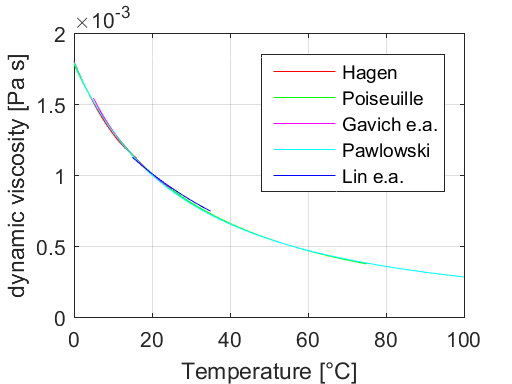

# 11 Flow Modeling


```python
%load_ext pymatbridge
```

    C:\Anaconda3\lib\site-packages\IPython\nbformat.py:13: ShimWarning: The `IPython.nbformat` package has been deprecated. You should import from nbformat instead.
      "You should import from nbformat instead.", ShimWarning)
    

    Starting MATLAB on ZMQ socket tcp://127.0.0.1:22629
    Send 'exit' command to kill the server
    .........MATLAB started and connected!
    

## 11.1 The Navier-Stokes Equations for Free Fluids


```python
%%matlab
%load ch11/viscosity_dyn.m
% Viscosity Intercomparison  
%   Dynamic viscosity of water in dependency of temperature   
%   
%   Ref: 

%   $Ekkehard Holzbecher  $Date: 2006/03/10 $

T_1 = [0:1:16];
mu_1 = 1.8e-3-06.55e-5*T_1+1.44e-6*T_1.*T_1;                % Hagen 1839 acc. to Prandtl/Tientjes
T_2 = [0:1:75];                                               
mu_2 = 0.001779./(1+0.03368*T_2+0.00022099*T_2.*T_2);       % Poiseuille 1840 acc. to Lamb 
T_3 = [100:1:300];
mu_3 = 241.4e-7*10.^(247.8./(T_3+132.15));                  % JSME 1968 
T_4 = [5:1:25];
mu_4 = 1.31*1.e-3./(0.7 + 0.03*T_4);                        % Gavich 1985 
T_5 = [0:1:100];
mu_5 = 0.001*(1.+0.636*(T_5-20)/41).^(-1/0.636);            % Pawlowski 1991 
T_6 = [15:1:35];
mu_6 = 1.98404e-6*exp(1825.85./(273+T_6));                  % Lin e.a. 2003  

plot (T_1,mu_1,'r',T_2,mu_2,'g',T_4,mu_4,'m',T_5,mu_5,'c',T_6,mu_6,'b')
legend ('Hagen','Poiseuille','Gavich e.a.','Pawlowski','Lin e.a.');
xlabel ('Temperature [°C]'); ylabel ('dynamic viscosity [Pa s]');

grid;
```





```python

```

## 11.2 The Euler Equations and the Bernoulli Theorem


```python
# load ch11/OpenChannel.m
function OpenChannel
% Open Channel Flow - energy height and water depth 
%    using MATLAB ode                   
%
%   $Ekkehard Holzbecher  $Date: 2006/04/27 $
%--------------------------------------------------------------------------
g = 10;       % acceleration due to gravity [m*m/s]
beta = 0.3;   % angle of ground inclination 
q = 1;        % discharge per unit width [m*m/s]
H = 2;        % energy height [m]

h = linspace (H/12,H,100);
plot (h,(h*cos(beta)+(q*q/2/g)*ones(size(h,1))./h./h),h,h*cos(beta));
legend ('Possible states','Asympotic line');
title ('constant discharge');
xlabel ('water level above ground');
ylabel ('energy height'); 
```

## 11.3 Darcy's Law for Flow in Porous Media

## 11.4 Flow in Unsaturated Porous Media


```python
# %load ch11/retention.m
function retention
% Retention curve examples     
%    using MATLAB                    
%
%   $Ekkehard Holzbecher  $Date: 2006/07/13 $
%
% Soil data from Hornberger and Wiberg, 2005
%--------------------------------------------------------------------------
qr = [0.153 0.19 0.131 0.218];
f = [0.25 0.469 0.396 0.52];
n = [10.4 7.09 2.06 2.03];
a = [0.0079 0.005 0.00423 0.0115];
p = linspace (0,200,50); 

figure
for i = 1:4
    m=1-(1/n(i));
    q = qr(i)+((f(i)-qr(i))./(((p.*a(i)).^n(i))+1).^m);
    plot (p,q);
    hold on;
end
legend ('Hygiene sandstone','Touchet Silt Loam','Silt Loam','Guelph Loam');
xlabel ('Suction head [cm]');
ylabel ('Volumetric water content [-]');


```


```python
# %load ch11/richards.m
function richards
% Solution of the Richards equation     
%    using MATLAB pdepe                   
%
%   $Ekkehard Holzbecher  $Date: 2006/07/13 $
%
% Soil data for Guelph Loam (Hornberger and Wiberg, 2005)
% m-file based partially on a first version by Janek Greskowiak 
%--------------------------------------------------------------------------
L = 200;                  % length [L]
s1 = 0.5;                 % infiltration velocity [L/T]
s2 = 0;                   % bottom suction head [L]
T = 4;                    % maximum time [T]
qr = 0.218;               % residual water content 
f = 0.52;                 % porosity
a = 0.0115;               % van Genuchten parameter [1/L]
n = 2.03;                 % van Genuchten parameter
ks = 31.6;                % saturated conductivity [L/T]

x = linspace(0,L,100);
t = linspace(0,T,25);

options=odeset('RelTol',1e-4,'AbsTol',1e-4,'NormControl','off','InitialStep',1e-7);
u = pdepe(0,@unsatpde,@unsatic,@unsatbc,x,t,options,s1,s2,qr,f,a,n,ks);

figure; 
title('Richards Equation Numerical Solution, computed with 100 mesh points');

subplot (1,3,1);
plot (x,u(1:length(t),:)); 
xlabel('Depth [L]');
ylabel('Pressure Head [L]');

subplot (1,3,2);
plot (x,u(1:length(t),:)-(x'*ones(1,length(t)))');
xlabel('Depth [L]');
ylabel('Hydraulic Head [L]');

for j=1:length(t)
    for i=1:length(x)
        [q(j,i),k(j,i),c(j,i)]=sedprop(u(j,i),qr,f,a,n,ks); 
    end 
end
 
subplot (1,3,3);
plot (x,q(1:length(t),:)*100)
xlabel('Depth [L]');
ylabel('Water Content [%]');

% -------------------------------------------------------------------------
function [c,f,s] = unsatpde(x,t,u,DuDx,s1,s2,qr,f,a,n,ks)
[q,k,c] = sedprop(u,qr,f,a,n,ks);
f = k.*DuDx-k;
s = 0;
% -------------------------------------------------------------------------
function u0 = unsatic(x,s1,s2,qr,f,a,n,ks)
u0 = -200+x; 
if x < 10 u0 = -0.5; end

% -------------------------------------------------------------------------
function [pl,ql,pr,qr] = unsatbc(xl,ul,xr,ur,t,s1,s2,qr,f,a,n,ks)
pl = s1; 
ql = 1; 
pr = ur(1)-s2;
qr = 0;

%------------------- soil hydraulic properties ----------------------------
function [q,k,c] = sedprop(u,qr,f,a,n,ks)
m = 1-1/n;
if u >= 0 
    c=1e-20;
    k=ks;
    q=f;
else
    q=qr+(f-qr)*(1+(-a*u)^n)^-m;
    c=((f-qr)*n*m*a*(-a*u)^(n-1))/((1+(-a*u)^n)^(m+1))+1.e-20;
    k=ks*((q-qr)/(f-qr))^0.5*(1-(1-((q-qr)/(f-qr))^(1/m))^m)^2;
end


  

```

## References


```python

```
