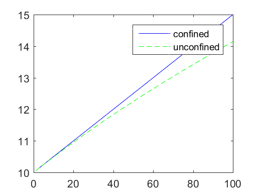
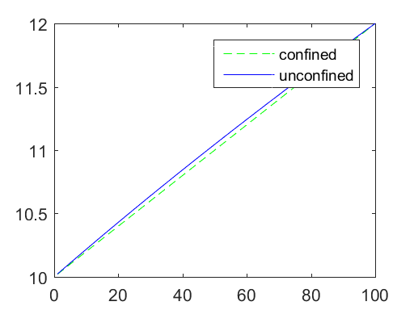
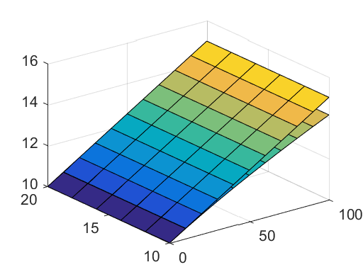
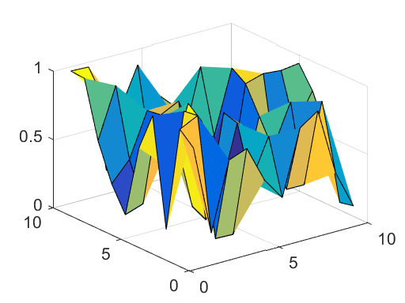

# 13 Aquifer Baseflow and 2D Meshing


```python
%load_ext pymatbridge
```

    C:\Anaconda3\lib\site-packages\IPython\nbformat.py:13: ShimWarning: The `IPython.nbformat` package has been deprecated. You should import from nbformat instead.
      "You should import from nbformat instead.", ShimWarning)
    

    Starting MATLAB on ZMQ socket tcp://127.0.0.1:23223
    Send 'exit' command to kill the server
    ......MATLAB started and connected!
    

## 13.1 1D Analysis

## 13.2 1D Implementation


```python
%%matlab
h0 = 10;
Qx0 = 5.e-5
K = 0.0001;

x = [1:1:100];

hc = h0 + (Qx0/(K*h0))*x;
hu = sqrt(h0*h0 + (2*Qx0/K)*x);

plot(x, hc, '-b', x, hu, '--g');
legend('confined', 'unconfined', 2)
```


    
    Qx0 =
    
       5.0000e-05
    





```python
%%matlab
L = 100;
h1 = 12;
hc = h0 + ((h1-h0)/L)*x;
hu = sqrt(h0*h0 + ((h1*h1-h0*h0)/L)*x);
plot(x,hc,'--g',x,hu,'-b');
legend('confined','unconfined',2)
```





## 13.3 2D Implementation


```python
%%matlab
[x,y] = meshgrid([0:10:100],[10:2:20]);

hc = h0 + (Qx0/(K*h0))*x;
hu = sqrt (h0*h0 + (2*Qx0/K)*x);

surf (x,y,hc);
hold on
surf (x,y,hu);
```





## 13.4 Meshs and Grids


```python
%%matlab
A = rand(10);
surf(A);
```





```python
%%matlab
[x, y] = meshgrid(linspace(xmin, xmax, 100), linspace(ymin, ymax, 100));
z = griddata (X(:, 1), X(:, 2), X(:, 3), x, y);
contourf(x, y, z);
```

## Reference


```python

```
