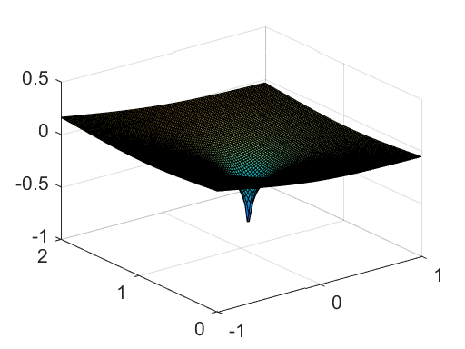
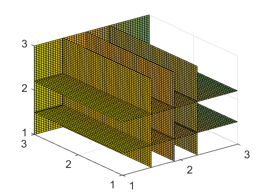
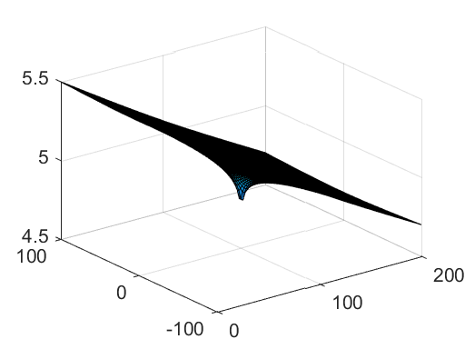
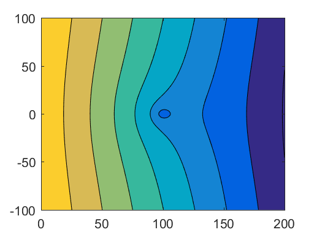

# 14 Potential and Flow Visualization


```python
%load_ext pymatbridge
```

    C:\Anaconda3\lib\site-packages\IPython\nbformat.py:13: ShimWarning: The `IPython.nbformat` package has been deprecated. You should import from nbformat instead.
      "You should import from nbformat instead.", ShimWarning)
    

    Starting MATLAB on ZMQ socket tcp://127.0.0.1:23254
    Send 'exit' command to kill the server
    ......MATLAB started and connected!
    

## 14.1 Definition and First Examples


```python
%%matlab
xmin = -1; xmax = 1;                    %x-coordinates
ymin = 0; ymax = 2;                     %y-coordinates
x0 = 0; y0 = .905;                      %source/sinklocation
Qx0 = 0.1; Qy0 = 0;                     %baseflowcomponents
Q = 1; %source/sinkrate
xvec = linspace(xmin, xmax, 100); 
yvec = linspace(ymin, ymax, 100); 
[x, y] = meshgrid(xvec, yvec);          %createmesh
r = sqrt((x-x0).^2+(y-y0).^2);          %distancestowell
phi = -Qx0*x-Qy0*y+(Q/(2*pi))*log(r);   %potential
surf(x, y, phi);                        %surfaceplot
```





```python
%%matlab
Q = 1;
Qx0 = 1;
i = linspace(1,3,50);
[x,y,z] = meshgrid (i,i,i);
r = sqrt((x-2.05).^2+(y-2.05).^2+(z-2.05).^2);
xslice = [1.5;1.9;2.3];
yslice = [3];
zslice = [1.5;2.2];
phi = -Qx0*x-Q/4/pi/r;
slice (x,y,z,phi,xslice,yslice,zslice)
```





## 14.2 Potential and Real World Variables

## 14.3 Example: Groundwater Baseflow and Well


```python
# %load ch14/gw_flow.m
function gw_flow
% groundwater flow 
%    using MATLAB analytical solutions                   
%
%   $Ekkehard Holzbecher  $Date: 2007/02/03 $
%--------------------------------------------------------------------------
% Baseflow
H = 6.;             % thickness [L]
h0 = 5.5;           % reference piezometric head [L] 
K = 5.e-5;          % hydraulic conductivity [L/T] 
por = 0.25;         % porosity []
Qx0 = 1.e-6;        % baseflow in x-direction [L^2/T]
Qy0 = 0;            % baseflow in y-direction [L^2/T]

% Wells
x0 = [99 145];      % x-coordinates well position [L]
y0 = [50 78];       % y-coordinates well position [L]
Q = [1.e-4 1.e-4];  % pumping / recharge rates [L^3/T]
R = [0.3 0.2];      % well radius [L]

% Mesh
xmin = 0;           % minimum x-position of mesh [L]
xmax = 200;         % maximum x-position of mesh [L]
ymin = 0;           % minimum y-position of mesh [L]
ymax = 200;         % maximum y-position of mesh [L]

% Reference point position in mesh
iref = 1; jref = 1;

% Graphical output options
gsurfh = 0;         % piezometric head surface plot
gcontf = 10;        % no. filled contour lines (=0: none)
gquiv = 0;          % arrow field plot
gflowp_fit = 10;    % flowpaths forward in time
gflowp_bit = 0;     % no. flowpaths backward in time (=0: none)
gflowp_dot = 5;     % flowpaths with dots indicating speed
gstream = 10;       % streamfunction plot

%----------------------------------------execution-------------------------------
xvec = linspace(xmin,xmax,100);
yvec = linspace(ymin,ymax,100);
[x,y] = meshgrid (xvec,yvec);                      % mesh
phi = -Qx0*x - Qy0*y;                              % baseflow potential
for j = 1:size(Q,2)
    r = sqrt((x-x0(j)).*(x-x0(j))+(y-y0(j)).*(y-y0(j)));   % distances to well
    phi = phi + (Q(j)/(2*pi))*log(r);              % potential
end
if h0 > H
    phi0 = -phi(iref,jref) + K*H*h0 - 0.5*K*H*H; 
else
    phi0 = -phi(iref,jref) + 0.5*K*h0*h0;          % reference potential 
end                                                
hc = 0.5*H+(1/K/H)*(phi+phi0);                     % head confined
hu = sqrt ((2/K)*(phi+phi0));                      % head unconfined
phicrit = phi0 + 0.5*K*H*H;                        % transition confined / unconfined
confined = (phi>=phicrit);                         % confined / unconfined indicator
h = confined.*hc+~confined.*hu;                    % head
psi = -Qx0*y + Qy0*x;
for j = 1:size(Q,2)
    psi = psi + (Q(j)/(pi+pi))*atan2((y-y0(j)),(x-x0(j)));  % streamfunction 
end
%---------------------------------------display messages-------------------
if all(all(confined))
    display ('aquifer confined');
else
    if all(all(~confined)) 
        display ('aquifer unconfined'); 
    else
        display ('aquifer partially confined and unconfined'); 
    end
end    
if any(any(h<0)) 
    display ('aquifer falls partially dry'); 
    h = max(0, h);
end

%--------------------------------------------------------------------------
[u,v] = gradient (-phi);                           % discharge vector  
Hh = confined.*H + ~confined.*h;                   % aquifer depth  
u = u./Hh/(xvec(2)-xvec(1))/por; v = v./Hh/(yvec(2)-yvec(1))/por;

%--------------------------------------graphical output--------------------
if gsurfh 
    figure; surf (x,y,h);                          % surface 
end 
if gcontf || gquiv || gflowp_fit || gflow_bit || gflowp_dot || gstream figure; end
if gcontf                                          % filled contours  
    colormap(winter); 
    contourf (x,y,h,gcontf,'w'); 
    colorbar; hold on;
end
if gquiv 
    quiver (x,y,u,v,'y'); hold on;                 % arrow field
end
if gflowp_fit                                      % flowpaths 
    xstart = []; ystart = [];
    for i = 1:100
        if v(1,i) > 0 xstart = [xstart xvec(i)];...
                ystart = [ystart yvec(1)]; end
        if v(100,i) < 0 xstart = [xstart xvec(i)];...
                ystart = [ystart yvec(100)]; end
        if u(i,1) > 0 xstart = [xstart xvec(1)];...
                ystart = [ystart yvec(i)]; end
        if u(i,100) < 0 xstart = [xstart xvec(100)];...
                ystart = [ystart yvec(i)]; end
    end
    h = streamline (x,y,u,v,xstart,ystart);
    set (h,'Color','r'); 
end
if gflowp_bit          
    for j=1,size(Q,2)
        if Q(j)>0           % only for pumping wells
            xstart = x0(j) + R(j)*cos(2*pi*[1:1:gflowp_bit]/gflowp_bit); 
            ystart = y0(j) + R(j)*sin(2*pi*[1:1:gflowp_bit]/gflowp_bit);
            h = streamline (x,y,-u,-v,xstart,ystart);
            set (h,'Color','y')
        end
    end
end
if gflowp_dot
    [verts ~] = streamslice(x,y,u,v,gflowp_dot);
    sc = 10/mean(mean(sqrt(u.*u+v.*v)));
    iverts = interpstreamspeed(x,y,u,v,verts,sc);  
    h = streamline(iverts);
    set (h,'Marker','.','Color','y','MarkerSize',18)
end
if gstream
    contour (x,y,psi,gstream,'k','LineWidth',1);  
end

```


```python
%%matlab
% Baseflow
H = 5.;                             % thickness[L]
h0 = 5.5;                           % referencepiezometrichead[L]
K = 5.e-5;                          % hydraulicconductivity[L/T]
Qx0 = 1.e-6;                        % baseflowinx-direction[L^2/T]
Qy0 = 0;                            % baseflowiny-direction[L^2/T]

% Well
x0 = 100;                           % x-coordinatewellposition[L]
y0 = 0;                             % y-coordinatewellposition[L]
Q = 1.e-4;                          % pumping/rechargerate[L^3/T]

% Mesh
xmin = 0; xmax = 200;               % min./max.x-positionofmesh[L]
ymin = -100; ymax = 100;            % min./max.y-positionofmesh[L]

% Reference point positionin mesh
iref = 1; jref = 1; 
xvec = linspace(xmin,xmax,100);
yvec = linspace(ymin,ymax,100);
[x,y] = meshgrid(xvec,yvec);%mesh
r = sqrt((x-x0).*(x-x0)+(y-y0).*(y-y0));  % distancestowell
phi = -Qx0*x + Qy0*y + (Q/(2*pi))*log(r);     % potential
phi0 = -phi(iref,jref) + K*H*h0 - 0.5*K*H*H;...

% reference potential
hc = 0.5*H + (1/K/H)*(phi+phi0);            % confined
surf(x,y,hc);%surfaceplot
```





```python
%%matlab
phi0 = -phi(iref,jref) + 0.5*K*h0*h0;    % reference potential
hu = sqrt ((2/K)*(phi+phi0));            % unconfined
contourf(x,y,hu);
```





## 14.4 MATLABR 2D Graphic


```python
%%matlab
% Graphical output options
gsurfh = 1;   % piezometric head surface plot

%----------------------------graphical output----------------
if gsurfh
  figure; surf(x, y, h); % surface
end

gcontf = 20;  % no. filled contour lines (=0: none)
gquiv = 1;    % arrow field plot

figure;

if gcontf     % filled contours
  contourf(x, y, h, gcontf,'w');
  colormap(winter);
  colorbar; hold on;
end

if gquiv
  quiver(x, y, u, v, 'y'); hold on; % arrow field
end
```

## 14.5 MATLABR 3D Graphic


```python
# %load ch14/ThreeD_flow.m
function ThreeD_flow
% 3D potential flow 
%    using MATLAB analytical solutions                   
%
%   $Ekkehard Holzbecher  $Date: 2006/07/19 $
%--------------------------------------------------------------------------
Q = 1;                            % source/sink-rate [L^3/T]
Qx0 = 0.2;                        % base flow [L^2/T]
i = linspace(1,3,50);
[x,y,z] = meshgrid (i,i,i);
r = sqrt((x-2).^2+(y-2).^2+(z-2).^2);
xslice = [1.3;1.7;2.4];
yslice = [3];
zslice = [1.05;1.9];
phi = -Qx0*x-Q/4/pi/r;
grid off;
slice (x,y,z,phi,xslice,yslice,zslice); hold on;
[u,v,w] = gradient (-phi);
h = streamline (x,y,z,u,v,w,ones(1,50),i,i);  
set (h,'Color','y')
% coneplot (x,y,z,u,v,w,)

```

## References

## Contents xvii


```python

```
