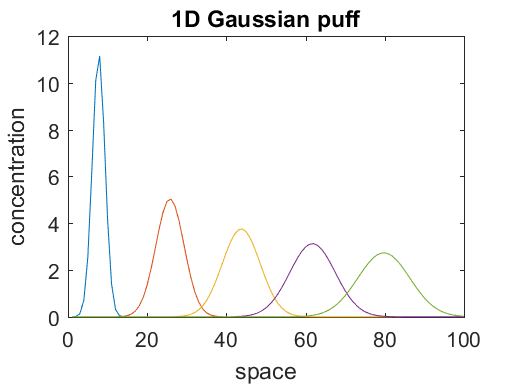

# 16 2D and 3D Transport Solutions (Gaussian Puffs and Plumes)


```python
%load_ext pymatbridge
```

    C:\Anaconda3\lib\site-packages\IPython\nbformat.py:13: ShimWarning: The `IPython.nbformat` package has been deprecated. You should import from nbformat instead.
      "You should import from nbformat instead.", ShimWarning)
    

    Starting MATLAB on ZMQ socket tcp://127.0.0.1:23718
    Send 'exit' command to kill the server
    ......MATLAB started and connected!
    

## 16.1 Introduction


```python
%%matlab
Dx = 0.000625;                    % diffusivity
v = 0.1;                          % velocity
M = 1;                            % mass
xmin = -0.05; xmax = 2.15;        % x-axisinterval
t = [1:4:20];                     % time
%-------------------------------execution--------------------
x = linspace(xmin,xmax,100);                        
c = [];            

for i = 1:size(t,2)
  xx = x - v*t(i);                        
  c = [c; (M/sqrt(4*pi*Dx*t(i))) * ones(1,size(x, 1)) .* exp(-(xx.*xx)/(4*Dx*t(i)))];                        
end

%---------------------------------output---------------------
plot(c'); 
hold on; 
xlabel('space');                      
ylabel('concentration'); 
title('1D Gaussian puff');                        
```





```python
# %load ch16/GaussianPuff.m
function GaussianPuff
% Gaussian puff model 
%    using MATLAB analytical solutions                   
%
%   $Ekkehard Holzbecher  $Date: 2006/08/21 $
%-----------------------------------------------------------------------
d = 3;                      % dimensionality
Dx = 0.004; Dy = 0.001; Dz = 0.001;  % diffusivities
v = 1;                      % velocity
M = 1;                      % mass
xmin = 0.85; xmax = 1.15;   % x-axis interval
ymin = -0.1; ymax = 0.1;    % y-axis interval (used only for d>1)
zmin = -0.1; zmax = 0.1;    % z-axis interval (used only for d>2)
t = [1:4:20];               % time
gplot = 1;                  % plot option (=1 yes; =0 no)
gcont = 2;                  % contour plot option (=2 filled; =1 yes; =0 none) 
gsurf = 0;                  % surface plot option (=1 yes; =0 no) 
                            %       (only for d<3)
%-------------------------------execution------------------------------
switch d
    case 1
        x = linspace (xmin,xmax,100);
        c = [];
        for i = 1:size(t,2)
            xx = x - v*t(i);
            c = [c; (M/sqrt(4*pi*Dx*t(i)))*ones(1,size(x)).*...
                exp(-(xx.*xx)/(4*Dx*t(i)))];
        end
    case 2
        if size(t,2) > 1 t = t(1); display('first time level is considered only');
        end
        [x,y] = meshgrid (linspace(xmin,xmax,100),linspace(ymin,ymax,100));
        xx = x - v*t;
        c = (M/4/pi/t/sqrt(Dx*Dy))*ones(100).*exp(-0.25*(xx.*xx/Dx + y.*y/Dy)/t);
    case 3
        if size(t,2) > 1 t = t(1); display('first time level is considered only');
        end
        [x,y,z] = meshgrid (linspace(xmin,xmax,45),...
            linspace(ymin,ymax,45),linspace(zmin,zmax,45));
        xx = x -v*t;
        c = (M/(sqrt(4*pi*t)^3)/sqrt(Dx*Dy*Dz))*ones(45,45,45)...
            .*exp(-0.25*(xx.*xx/Dx + y.*y/Dy + z.*z/Dz)/t);
end

%---------------------------------output-------------------------------
if gplot
    switch d
        case 1
            plot (c'); hold on; xlabel ('space');
            ylabel ('concentration'); title ('1D Gaussian puff');
        case 2
            for i = 10:10:100
                plot (c(:,i)); hold on;
            end
            xlabel ('x'); ylabel ('concentration'); 
            title ('2D Gaussian puff along slices y=const)');  
        case 3
            for i = 5:5:45
                plot (c(:,i,23)); hold on;
            end
            xlabel ('x'); ylabel ('concentration'); 
            title ('3D Gaussian puff along line x=0');
    end
    colorbar
end

switch gcont
    case 1               % contours
        figure;
        switch d
            case 1
                contour (x,t,c,30);    
                grid on; xlabel ('space'); ylabel ('time');
            case 2
                contour (x,y,c,30);  
                xlabel ('x'); ylabel ('y'); 
            case 3
        end
        title ('concentration'); 
    case 2               % filled contours
        figure;
        switch d
            case 1
                contourf(x,t,c,30);   
                colorbar; xlabel ('space'); ylabel ('time');
            case 2
                contourf (x,y,c,30); 
                colorbar; xlabel ('x'); ylabel ('y'); 
            case 3
                xslice = [xmin 0.5*(xmin+xmax) xmax];
                yslice = [ymax];
                zslice = [zmin 0.5*(zmin+zmax) zmax];
                slice (x,y,z,c,xslice,yslice,zslice); 
                xlabel ('x'); ylabel ('y'); zlabel ('z');
        end
        title ('concentration'); 
end    
if gsurf
    figure; 
    switch d
            case 1
                surf(x,t,c);   
                colorbar; xlabel ('space'); ylabel ('time');
            case 2
                surf (x,y,c); 
                colorbar; xlabel ('x'); ylabel ('y'); 
            case 3
    end
    title ('concentration');
end


```

## 16.2 2D Instantaneous Line Source


```python

```

## 16.3 2D Constant Line Source


```python

```

## 16.4 3D Instanteneous Source


```python

```

## 16.5 3D Constant Source


```python
# %load ch16/GaussianPlume.m
function GaussianPlume
% Gaussian plume model 
%    using MATLAB analytical solutions                   
%
%   $Ekkehard Holzbecher  $Date: 2006/08/21$
%-----------------------------------------------------------------------
Dy = 0.2; Dz = 1;           % diffusivities
v = 0.5;                    % velocity
lambda = 0;                 % decay rate
Q = 1;                      % emission rate(s)
xstack = 0; ystack = 50;    % stack location(s)
xmin = 10; xmax = 1000;     % x-axis interval
ymin = 0; ymax = 100;       % y-axis interval (used only for d>1)
H = 50;                     % effective stack height(s) 
z = 0;                      % height of observation (=0 for ground surface)
gplot = 1;                  % plot option (=1 yes; =0 no)
gcont = 2;                  % contour plot option (=2 filled; =1 yes; =0 none) 

%----------------------------------execution-------------------------------
[x,y] = meshgrid (linspace(xmin,xmax,100),linspace(ymin,ymax,100));
c = zeros (size(x)); e = ones(size(x));
for i = 1:size(Q,2)
    xx = x - xstack(i); yy = y - ystack(i); 
    c = c + Q(i)*e./(4*pi*xx*sqrt(Dy*Dz)).*exp(-v*yy.*yy./(4*Dy*xx)).*... 
    (exp(-v*(z-H(i))*(z-H(i))*e./(4*Dz*xx))+exp(-v*(z+H(i))*(z+H(i))*e./(4*Dz*xx)))...
    .*exp(-lambda*xx/v);
end

%----------------------------------output----------------------------------
if gplot
    for i = 10:10:100
	    plot (c(:,i)); hold on;
    end
end
if gcont
    figure;
    if gcont > 1
        contourf (x,y,c); colorbar;
    else
        contour (x,y,c); 
    end
end

```

## References


```python

```
