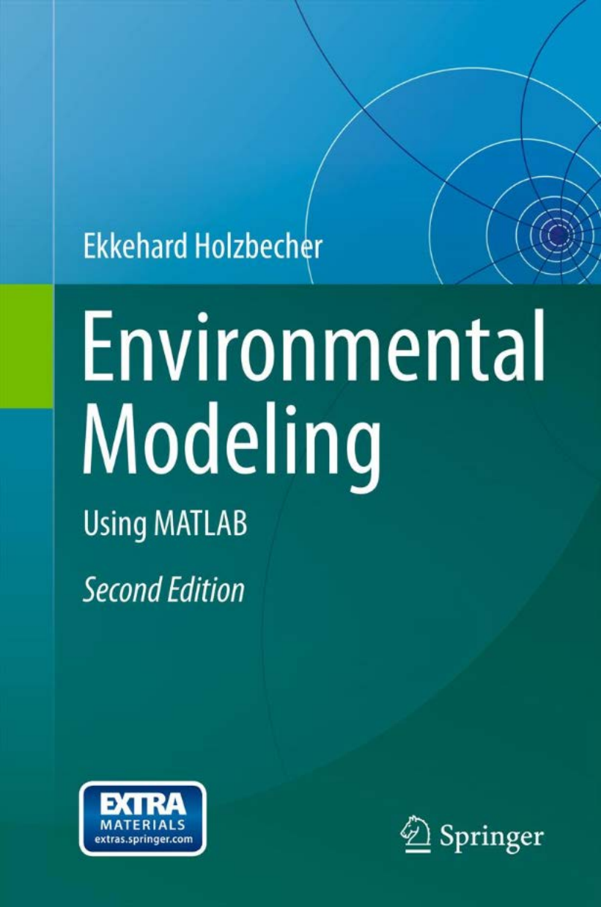

# INFO
  

* __Publihser__ http://link.springer.com/book/10.1007/978-3-642-22042-5  

# TOC
* [Ch01 Introduction]()  
* [Ch02 Fundamentals of Modeling, Principles and MATLAB]()  
* [Ch03 Transport]()  
* [Ch04 Transport Solutions]()  
* [Ch05 Transport with Decay and Degradat ion]()  
* [Ch06 Transport and Sorption]()  
* [Ch07 Transport and Kinetics]()  
* [Ch08 Transport and Equilibrium Reactions]()  
* [Ch09 Ordinary Differential Equations: Dynamical Systems]()  
* [Ch10 Parameter Estimation]()  
* [Ch11 Flow Modeling]()  
* [Ch12 Groundwater Drawdown by Pumping]()  
* [Ch13 Aquifer Baseflow and 2D Meshing]()  
* [Ch14 Potential and Flow Visualization]()  
* [Ch15 Streamfunction and Complex Potential]()  
* [Ch16 2D and 3D Transport Solutions (Gaussian Puffs and Plumes)]()  
* [Ch17 Image Processing and Geo-Referencing]()  
* [Ch18 Compartment Graphs and Linear Systems]()  
* [Ch19 Nonlinear Systems]()  
* [Ch20 Graphical User Interfaces]()  
* [Ch21 Numerical Methods: Finite Differences]()  